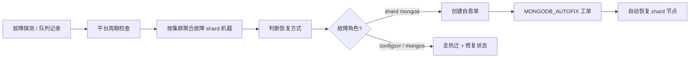

# 第 14 章 · DBHA 与故障自愈

> 蓝鲸 DBM 中 MongoDB 的**接入层高可用（DBHA）与故障恢复**是两条不同链路：前者在 **mongos 不可用时从 DNS/CLB 摘除故障节点**；后者根据故障角色选择不同恢复方式。目标机制是：**shard 节点故障自动发起 `MONGODB_AUTOFIX` 自愈单**；**configsvr / mongos 节点故障通过热迁 + 状态修复处理**。本章说明适用范围、流程与排障入口。

---

## 14.1 概念区分（必读）

| 能力                | 作用对象                       | 触发方                | 典型结果                                              |
| ----------------- | -------------------------- | ------------------ | ------------------------------------------------- |
| **MongoDB 副本集选举** | 分片内 shard / 副本集 **mongod** | MongoDB 内核         | Primary 在 m1/m2 间切换；**不由 DBHA 服务驱动**              |
| **DBHA（mongos）**  | **分片集群接入层 mongos**         | `dbha` 探测失败 → 切换队列 | 从 **DNS / CLB** 摘掉故障 mongos IP                    |
| **故障自愈（Autofix）** | shard 节点所在机器               | 周期任务识别故障 → 建单      | `MONGODB_AUTOFIX` → 类似整机替换，申请新机并恢复 shard 节点       |
| **热迁 + 修复状态**     | configsvr / mongos 节点      | 人工或平台编排触发          | 先把实例迁到新机，再通过 `MONGODB_INSTANCE_FIX_STATUS` 修复实例状态 |

> 📌 **副本集业务高可用**：依赖 **≥3 成员 + m1/m2 `priority=1` + backup `priority=0`**，见 [第 2 章](02-cluster-topology.md)。  
> **分片集群业务入口高可用**：依赖 **≥2 个 mongos** + 集群入口域名/CLB；DBHA 只负责「坏 mongos 不再被解析到」，**不替代** shard 内 mongod 选主。

---

## 14.2 DBHA：mongos 探测与切换

### 14.2.1 适用范围

| 项目       | 说明                                                                              |
| -------- | ------------------------------------------------------------------------------- |
| **集群类型** | 仅 **`MongoShardedCluster`**                                                     |
| **实例类型** | 仅 **`mongos`**                                           |
| **不覆盖**  | 副本集 `MongoReplicaSet`、config server、shard 上的 **mongod**（存储层切换由 MongoDB 副本集机制处理） |

### 14.2.2 探测逻辑（Agent）

对每个 mongos（同一主机只探测**最小端口**实例）：

1. 连接 `mongodb://<ip>:<port>`，执行 **`buildInfo`** 类探测命令。
2. 若连接/命令失败 → 再 **SSH** 探测（`touch` 标记文件；区分认证失败与主机不可达）。
3. 状态上报 GDM；失败实例进入切换流水线。

### 14.2.3 切换逻辑（GDM）

切换步骤概要：

| 步骤                 | 动作                                                                         |
| ------------------ | -------------------------------------------------------------------------- |
| **切换前检查** | 校验目标实例为 mongos；若绑定了 DNS，要求域名下至少还有 1 个其他 IP，避免把入口摘空 |
| **摘除流量** | 从域名解析或 CLB 后端摘除故障 mongos |
| **状态处理** | MongoDB mongos 切换不做主从对调；后续实例恢复走热迁 + 状态修复 |

切换成功/失败会向蓝鲸监控上报自定义事件（与 [第 13 章告警策略](13-performance-views.md#136-mongodb-告警策略) 对应）：

| 事件名                       | 告警级别  | 含义              |
| ------------------------- | ----- | --------------- |
| `dbha_mongos_switch_succ` | 3（提醒） | 已从入口摘除故障 mongos |
| `dbha_mongos_switch_err`  | 1（严重） | 摘除 DNS/CLB 失败   |

### 14.2.4 运维注意

- **mongos 至少 2 台**：与拓扑规范一致；仅 1 台时 DBHA 可能因「DNS 只剩 1 IP」而 **拒绝切换**。
- **CLB / DNS 工单**：接入层需先按平台规范绑定；无 DNS/CLB 时不会产生摘流效果，切换效果依赖客户端连接方式。
- **切换 ≠ 换机**：DBHA 只做**流量摘除**；若要恢复 mongos 实例，目标上应走 **热迁 + 状态修复**，而不是直接自动自愈换机。

---

## 14.3 故障恢复目标机制(TODO)

### 14.3.1 角色分工

MongoDB 故障恢复不要把所有角色都归到同一个“自动换机”动作里。目标口径如下：

| 故障角色             | 推荐恢复方式                             | 说明                                               |
| ---------------- | ---------------------------------- | ------------------------------------------------ |
| **shard 节点**     | 自动发起 `MONGODB_AUTOFIX`             | 类似整机替换：申请新机、安装实例、恢复复制关系、回收旧节点                    |
| **configsvr 节点** | 热迁 + `MONGODB_INSTANCE_FIX_STATUS` | config server 保存分片元数据，恢复动作应更受控；迁移完成后修复 DBM 侧实例状态 |
| **mongos 节点**    | 热迁 + `MONGODB_INSTANCE_FIX_STATUS` | mongos 是无状态接入层；DBHA 负责先摘流，实例恢复用热迁和状态修复闭环         |

相关工单：

| 工单类型                          | 用途                                              |
| ----------------------------- | ----------------------------------------------- |
| `MONGODB_AUTOFIX`             | shard 节点故障后的自动自愈                                |
| `MONGODB_SHARD_MIGRATE`       | 分片集群实例热迁，包括 shard / configsvr / mongos 场景中的实例迁移 |
| `MONGODB_INSTANCE_FIX_STATUS` | 迁移、摘流或人工处理后修复 MongoDB 节点状态                      |

### 14.3.2 自愈框架

平台会周期性识别故障记录，按集群和故障机器聚合后判断是否需要创建自愈单。目标上只应把 **shard 节点故障**推进到自动自愈单；configsvr / mongos 故障转为热迁和状态修复流程。

**总开关**：当自动自愈开关关闭时，shard 节点自动自愈不推进。

### 14.3.3 shard 节点自愈触发链路

1. 平台定期读取故障记录，按 **故障 IP** 和集群聚合。
2. 过滤忽略列表、多集群共用 IP 等异常场景。
3. 目标上仅对 **shard mongod** 故障创建自愈单。
4. 以业务 MongoDB DBA 为创建人自动提交 **`MONGODB_AUTOFIX`**，并企业微信通知。
5. configsvr / mongos 故障不应直接进入自动换机自愈，而是转为热迁和状态修复流程。

工单常量见 [第 4 章 §4.7](04-tickets.md#47-插件与观测4-项)。

### 14.3.4 工单处理边界

| 故障对象                                 | 工单 / 处理方式                                               | 行为概要                                     |
| ------------------------------------ | ------------------------------------------------------- | ---------------------------------------- |
| **MongoReplicaSet 节点**               | 整机替换 / 自愈                                               | 对故障机上的 mongod 做整机替换（资源池申请 → 安装 → 元数据/域名） |
| **MongoShardedCluster shard 节点**     | `MONGODB_AUTOFIX`           | 自动自愈，行为类似整机替换，恢复 shard 副本集成员             |
| **MongoShardedCluster configsvr 节点** | `MONGODB_SHARD_MIGRATE` + `MONGODB_INSTANCE_FIX_STATUS` | 先热迁到新机，再修复实例状态；不建议直接走自动换机自愈              |
| **MongoShardedCluster mongos 节点**    | `MONGODB_SHARD_MIGRATE` + `MONGODB_INSTANCE_FIX_STATUS` | DBHA 先摘除故障 mongos 流量；后续热迁并修复状态           |

> 📌 **为什么 mongos / configsvr 不直接自动自愈？**
>
> mongos 是无状态接入层，故障后优先由 DBHA 摘流，恢复更适合走“迁移实例 + 修复状态”；configsvr 承载分片元数据，恢复动作需要更谨慎，避免把状态修复、元数据变更和自动换机混在一个不可控链路里。

### 14.3.5 自愈进度

| 阶段 | 含义 |
| --- | --- |
| 准备建单 | 平台已识别故障，等待创建自愈单 |
| 工单执行中 | 自愈单已创建，正在申请资源、安装实例或恢复复制关系 |
| 终态 | 自愈成功或失败，需要在工单详情中查看结果 |

可在 DBM 工单列表按类型 **`MONGODB_AUTOFIX`** 跟踪；失败时查看工单详情与 Job 日志。

---

## 14.4 与监控、bk-dbmon 的关系

| 来源                     | 说明                                                              |
| ---------------------- | --------------------------------------------------------------- |
| **DBHA 事件告警**          | [第 13 章告警策略](13-performance-views.md#136-mongodb-告警策略)      |
| **`mongo_restart` 事件** | 多为 **计划内** 工单/脚本重启，不是 DBHA 自愈本身 |
| **维护窗口**               | 变更前 `bk-dbmon alarm shield`，避免重启、摘流误报（[第 6 章](06-bk-dbmon.md)）  |
| **副本集 Primary 漂移**     | 看复制延迟、角色面板；**无需**等 DBHA 事件                                      |

---

## 14.5 排障速查

| 现象                                     | 优先检查                                                    |
| -------------------------------------- | ------------------------------------------------------- |
| 收到 `dbha_mongos_switch_err`            | mongos 是否仍挂在 DNS/CLB；域名下是否只剩 1 IP；CLB API / 权限          |
| 收到 `dbha_mongos_switch_succ` 但业务仍连旧 IP | 客户端 DNS 缓存、长连接未重建；是否直连 IP 而非集群域名                        |
| shard 节点故障未自动自愈                        | 自动自愈开关是否关闭；IP 是否在忽略列表；故障记录是否生成 |
| shard 自愈单卡住                            | 资源池规格/园区约束；`MONGODB_AUTOFIX` 工单节点失败日志             |
| configsvr / mongos 故障恢复后状态不对           | 检查热迁工单结果，并通过 `MONGODB_INSTANCE_FIX_STATUS` 修复节点状态       |
| 副本集 Primary 不可用                        | **rs.status()**、选举、网络；走 **实例重启/整机替换** 工单，而非 DBHA        |
| 分片 shard 主节点切换                         | shard 副本集选举；DBHA **不会** 切换 mongod                       |

---

[⬅ 上一章 · 第 13 章 DBM 性能视图](13-performance-views.md) ｜ [📖 返回目录](README.md) ｜ [下一章 · 第 15 章 附录 ➡️](15-appendix.md)